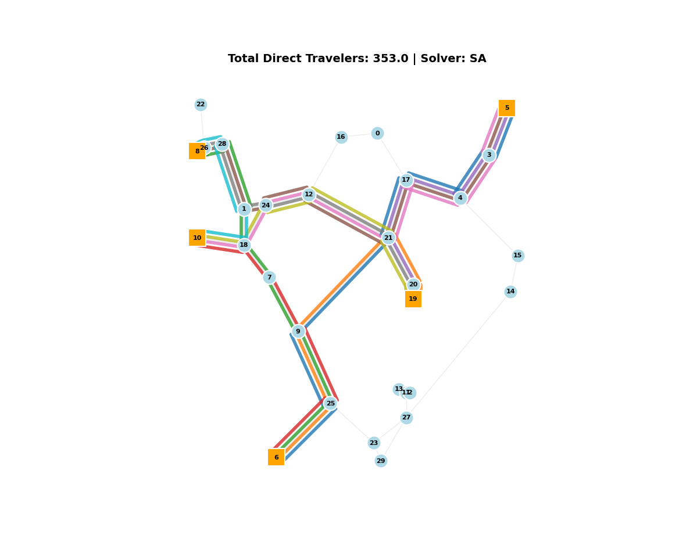

# Samples

## Random Network (Mixed Integer Programming)

```
python main.py --network random --solver mip --stations 30 --classification_yards 5 --capacity 500
```

```
***********************************************************
Network: random
Solver: MIP
Candidate Lines: 10
Active Lines: 9
Objective (Total Direct Travelers): 353.0
***********************************************************
Line  0 [Frequency:  1]: [6, 25, 9, 21, 17, 4, 3, 5]
Line  1 [Frequency:  1]: [6, 25, 9, 21, 20, 19]
Line  2 [Frequency:  1]: [6, 25, 9, 7, 18, 1, 28, 26, 8]
Line  3 [Frequency:  1]: [6, 25, 9, 7, 18, 10]
Line  4 [Frequency:  1]: [5, 3, 4, 17, 21, 20, 19]
Line  5 [Frequency:  1]: [5, 3, 4, 17, 21, 12, 24, 1, 28, 26, 8]
Line  7 [Frequency:  1]: [19, 20, 21, 12, 24, 1, 28, 26, 8]
Line  8 [Frequency:  1]: [19, 20, 21, 12, 24, 18, 10]
Line  9 [Frequency:  1]: [8, 26, 28, 1, 18, 10]
```

## Random Network (Simulated Annealing)

```
python main.py --network random --solver sa --stations 50 --classification_yards 8 --capacity 400
```

```
***********************************************************
Network: random
Solver: SA
Candidate Lines: 21
Active Lines: 19
Objective (Total Direct Travelers): 1609.0
***********************************************************
Line  0 [Frequency:  1]: [29, 23, 32, 25, 41, 33, 46, 19, 20, 21, 31, 4, 42, 48, 14, 44, 43]
Line  1 [Frequency:  1]: [29, 23, 32, 25, 41, 9, 35, 7, 18, 1, 24, 40, 28, 26, 8]
Line  2 [Frequency:  5]: [29, 23, 32, 25, 41, 9, 35, 7, 18, 37, 38, 10]
Line  4 [Frequency:  7]: [29, 23, 32, 25, 41, 33, 46, 19, 20, 21, 31, 4, 34, 47]
Line  5 [Frequency:  1]: [29, 23, 27, 11, 2]
Line  6 [Frequency:  3]: [43, 44, 14, 48, 42, 4, 31, 12, 24, 40, 28, 26, 8]
Line  7 [Frequency:  3]: [43, 44, 14, 48, 42, 4, 31, 12, 24, 1, 18, 37, 38, 10]
Line  8 [Frequency:  4]: [43, 44, 14, 48, 42, 4, 31, 21, 20, 19, 46, 33, 41, 25, 32, 6, 36]
Line  9 [Frequency:  9]: [43, 44, 14, 48, 42, 4, 34, 47]
Line 10 [Frequency:  1]: [43, 44, 14, 48, 42, 4, 31, 21, 20, 19, 46, 33, 41, 13, 11, 2]
Line 11 [Frequency:  3]: [8, 26, 28, 40, 24, 1, 18, 37, 38, 10]
Line 12 [Frequency:  1]: [8, 26, 28, 40, 24, 1, 18, 7, 35, 9, 41, 25, 32, 6, 36]
Line 13 [Frequency:  1]: [8, 26, 28, 40, 24, 12, 31, 4, 34, 47]
Line 14 [Frequency:  2]: [8, 26, 28, 40, 24, 1, 18, 7, 35, 9, 41, 13, 11, 2]
Line 15 [Frequency:  3]: [10, 38, 37, 18, 7, 35, 9, 41, 25, 32, 6, 36]
Line 17 [Frequency:  1]: [10, 38, 37, 18, 7, 35, 9, 41, 13, 11, 2]
Line 18 [Frequency:  1]: [36, 6, 32, 25, 41, 33, 46, 19, 20, 21, 31, 4, 34, 47]
Line 19 [Frequency:  6]: [36, 6, 32, 23, 27, 11, 2]
Line 20 [Frequency:  2]: [47, 34, 4, 31, 21, 20, 19, 46, 33, 41, 13, 11, 2]
```

## Custom Network

```
python main.py --network data/pid.txt --solver mip
```

```
***********************************************************
Network: data/pid.txt
Solver: MIP
Candidate Lines: 528
Active Lines: 26
Objective (Total Direct Travelers): 144424.0
***********************************************************
Line 31 [Frequency:  5]: [1, 2, 3, 4, 5, 6, 7, 8, 9, 10, 11, 12, 14, 15, 16, 17, 18, 19, 20, 21, 218, 219, 220, 221, 280]
Line 45 [Frequency:  5]: [28, 27, 26, 25, 24, 23, 76, 75, 74, 73, 72, 71, 70, 69, 68, 67, 66, 103, 40, 41, 42, 43, 44, 45, 46, 47, 123, 124, 125, 126, 127, 128, 129, 130, 176]
Line 62 [Frequency:  5]: [28, 27, 26, 25, 24, 23, 22, 21, 218, 219, 220, 221, 280]
Line 96 [Frequency:  6]: [48, 49, 50, 51, 52, 53, 55, 56, 57, 58, 59, 60, 61, 62, 63, 64, 65, 105, 106, 31, 107, 120, 14, 119, 118, 117, 116, 115, 114, 84, 83, 113, 112, 111]
Line 121 [Frequency:  5]: [48, 49, 50, 51, 52, 53, 55, 56, 57, 58, 59, 60, 61, 62, 104, 40, 103, 66, 67, 68, 69, 110, 235, 236, 237, 238, 239, 240, 21, 218, 219, 220, 221, 280]
Line 142 [Frequency:  5]: [77, 78, 79, 80, 81, 82, 83, 84, 114, 115, 116, 117, 118, 119, 14, 120, 107, 31, 32, 33, 34, 35, 103, 101, 100, 191, 193, 194, 195]
Line 149 [Frequency:  5]: [77, 78, 79, 80, 81, 82, 83, 84, 85, 86, 87, 88, 89, 90, 91, 21, 218, 219, 220, 221, 280]
Line 204 [Frequency:  2]: [111, 112, 113, 83, 84, 114, 115, 116, 117, 118, 119, 14, 120, 107, 31, 32, 33, 34, 122, 40, 41, 42, 43, 44, 45, 46, 47, 123, 124, 125, 126, 127, 128, 129, 130, 131, 132]
Line 227 [Frequency:  4]: [111, 112, 113, 83, 84, 85, 86, 87, 88, 89, 90, 91, 21, 218, 219, 220, 221, 280]
Line 251 [Frequency:  3]: [118, 117, 262, 18, 19, 20, 21, 218, 219, 220, 221, 280]
Line 257 [Frequency:  2]: [132, 176]
Line 274 [Frequency:  3]: [132, 131, 130, 129, 128, 127, 126, 125, 124, 123, 47, 46, 45, 44, 43, 42, 41, 40, 103, 66, 67, 68, 69, 110, 235, 236, 237, 238, 239, 240, 21, 218, 219, 220, 221, 280]
Line 296 [Frequency:  4]: [133, 134, 135, 136, 9, 10, 11, 12, 14, 15, 16, 17, 18, 19, 20, 21, 218, 219, 220, 221, 280]
Line 309 [Frequency:  5]: [147, 146, 145, 144, 143, 142, 266, 265, 264, 101, 100, 99, 98, 97, 96, 95, 73, 74, 75, 76, 22, 21, 218, 242, 243, 244, 246, 247, 248, 228, 229, 230, 231]
Line 311 [Frequency:  2]: [147, 146, 145, 144, 143, 142, 141, 234, 233, 232, 198, 199, 200, 201, 213, 214, 215, 251, 252, 254, 255, 256, 257, 258, 259, 260]
Line 319 [Frequency:  8]: [148, 149, 150, 151, 152, 153, 154, 155, 156, 157, 158, 136, 9, 30, 31, 32, 33, 34, 122, 104, 62, 159, 175, 174, 173, 172, 171]
Line 356 [Frequency:  5]: [170, 169, 168, 167, 166, 165, 164, 163, 162, 161, 160, 159, 62, 104, 40, 103, 66, 67, 68, 69, 110, 235, 236, 237, 238, 239, 240, 21, 218, 219, 220, 221, 280]
Line 389 [Frequency:  5]: [176, 130, 129, 128, 127, 126, 125, 124, 123, 47, 46, 45, 44, 43, 42, 41, 138, 139, 140, 141, 142, 272, 273, 276, 277, 278]
Line 395 [Frequency:  4]: [177, 178, 179, 180, 181, 182, 183, 184, 185, 186, 187, 188, 189, 190, 31, 32, 33, 34, 35, 103, 101, 100, 191, 193, 194, 195, 196, 199, 200, 201, 202, 203, 204, 205, 206, 207, 208, 209, 210, 211, 212]
Line 401 [Frequency: 10]: [177, 178, 179, 180, 181, 182, 183, 184, 185, 186, 187, 188, 189, 190, 31, 107, 108, 109, 110, 70, 71, 72, 73, 95, 94, 93, 217, 216, 215, 251, 252, 254, 255, 256, 257, 258, 259, 260]
Line 407 [Frequency:  5]: [177, 178, 179, 180, 181, 182, 183, 184, 185, 186, 241, 8, 9, 10, 11, 12, 14, 15, 16, 17, 18, 19, 20, 21, 218, 219, 220, 221, 280]
Line 453 [Frequency:  4]: [212, 211, 210, 209, 208, 207, 206, 205, 204, 203, 202, 213, 214, 215, 216, 217, 93, 92, 75, 76, 22, 21, 218, 242, 243, 244, 246, 247, 248, 228, 229, 230, 231]
Line 458 [Frequency:  1]: [212, 211, 210, 209, 208, 207, 206, 205, 204, 203, 202, 213, 214, 215, 216, 217, 93, 92, 75, 76, 22, 21, 218, 242, 243, 244, 246, 247, 248, 227]
Line 459 [Frequency:  4]: [212, 211, 210, 209, 208, 207, 206, 205, 204, 203, 202, 201, 200, 199, 198, 232, 233, 234, 141, 142, 272, 273, 276, 277, 278]
Line 499 [Frequency:  5]: [231, 230, 229, 228, 227, 226, 225, 224, 223, 222, 221, 280]
Line 504 [Frequency:  2]: [195, 196, 232, 233, 234, 141, 142, 272, 273, 276, 277, 278]
```

## Visualization Mode

```
python main.py --network random --solver sa --visualize
```

